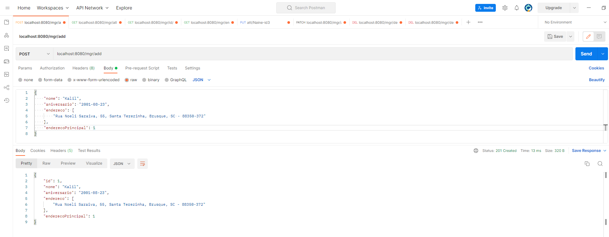
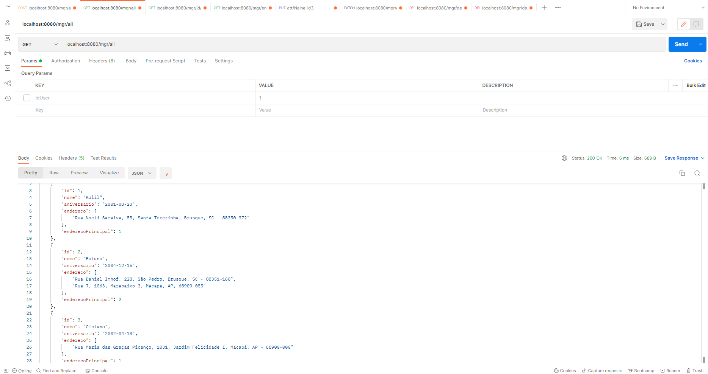
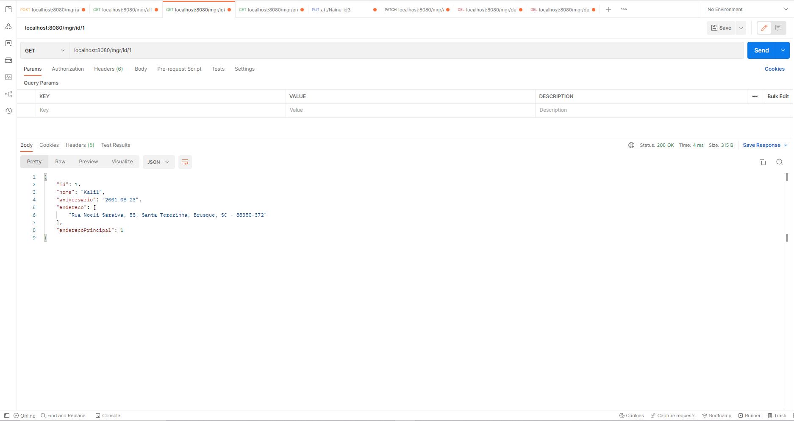
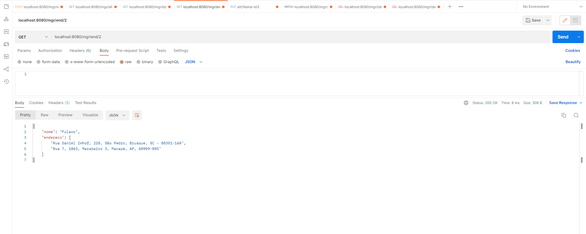
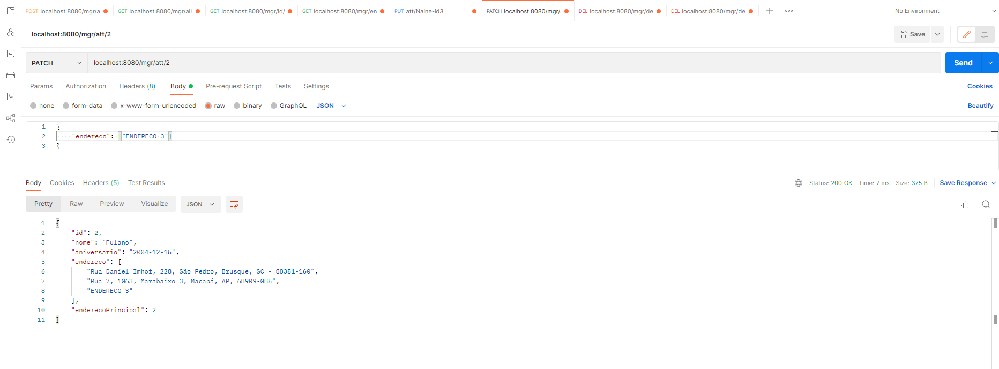
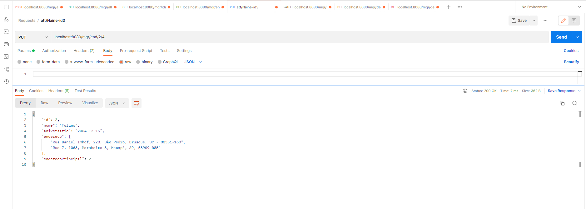
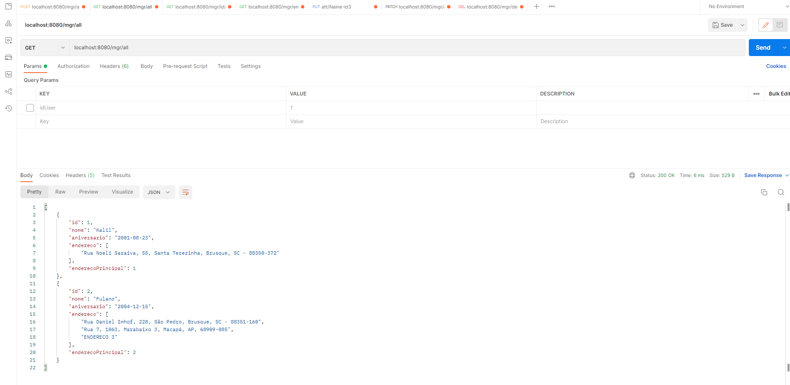

# API Rest Springboot
### Programa proposto ao desafio da vaga da empresa Attornatus.
### Desenvolvido em Java, utilizando Springboot, Web Service Spring, Banco de Dados H2.

## DESAFIO PROPOSTO

### Usando Spring boot, crie uma API simples para gerenciar Pessoas. Esta API deve permitir:  
>1. [X]	Criar uma pessoa  
>
>1. [X]	Editar uma pessoa 
>
>1. [X]	Consultar uma pessoa 
>
>1. [X]	Listar pessoas 
>
>1. [X]	Criar endereço para pessoa 
>
>1. [X]	Listar endereços da pessoa 
>
>1. [X]	Poder informar qual endereço é o principal da pessoa    

---
### Uma Pessoa deve ter os seguintes campos:  
>1. Nome
>
>1. Data de nascimento
>
>1.	Endereço:
>       1.	Logradouro
>       1.	CEP
>       1.	Número
>       1.	Cidade
---

## API REST DESENVOLVIDO COM SPRING BOOT

##### REQUISITOS PARA EXECUTAR O API

- JRE 18, versão 341, classe 61
- Nenhum serviço rodando na porta 8080 (pode ser alterado em "application.properties"
- Funciona normalmemnte na rede local e externamente (se as portas estiverem abertas)

### 1. ADIÇÃO DE DADOS

Adição feito por um corpo JSON, pode ser feita diretamente pela URL caso for utilizar em uma página sem a necessidade de JS. 

### 2. LISTAR TODOS OS DADOS

Listar todos os dados dos usuários apenas com o /all

### 3. LISTAR DADOS ESPECIFICOS

Lista dados de Usuário específico com /id/<número da id>

### 4. LISTAR ENDEREÇOS DE PESSOA ESPECIFICA

Lista endereços da pessoa com /end/<número da id>

### 5. ATUALIZAR QUALQUER DADO DA PESSOA

Atualiza os dados da pessoal por um corpo JSON, pode ser alterado todos ou apenas alguns.

### 6. DEFININDO UM ENDEREÇO PRINCIPAL PARA PESSOA

Define o endereço principal da Pessoa pela URL, ela pode visualizar antes e definir logo em seguida digitando /end/Lista endereços da pessoa com /end/<número_da_id>/<posição_do_endereço principal_dela>, além de evitar colocar um número acima da quantidade existente de endereços registrados no nome da Pessoa

### 7. DELETANDO DADOS DA PESSOA

Deleta todos os dados da Pessoa

